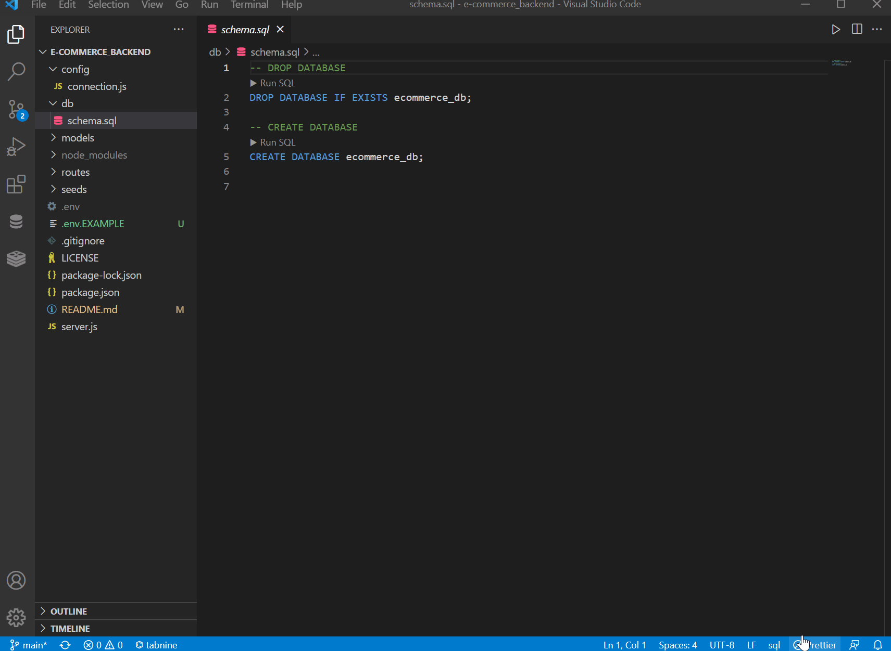
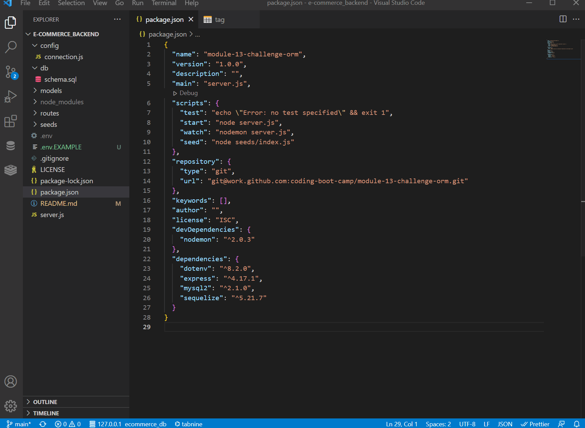

# e-commerce_backend

E-Commerce Backend

[Repository Link](https://github.com/ElusiveSkies/e-commerce_backend)

## Table of Contents

- [Installation](#Installation)
- [Usage](#Usage)
- [License](#License)
- [Questions](#Questions)

## Description

An application that allows to view and update a database of products:
```md
GIVEN a functional Express.js API
WHEN I add my database name, MySQL username, and MySQL password to an environment variable file
THEN I am able to connect to a database using Sequelize
WHEN I enter schema and seed commands
THEN a development database is created and is seeded with test data
WHEN I enter the command to invoke the application
THEN my server is started and the Sequelize models are synced to the MySQL database
WHEN I open API GET routes in Insomnia Core for categories, products, or tags
THEN the data for each of these routes is displayed in a formatted JSON
WHEN I test API POST, PUT, and DELETE routes in Insomnia Core
THEN I am able to successfully create, update, and delete data in my database
```

## Installation

- From the integrated terminal the user will type:


  **npm i**

- Followed by pressing enter.
This will result in the installation of *sequelize* and *MySQL2*

- Rename the file:

"*.env.EXAMPLE*" to "*.env*" and add user credentials before use.

- The `schema.sql` file in the `db` folder will need to be run to create the database with MySQL shell commands.

- The database will then need to be seeded from the main folder by running the following command:

**npm run seed**


## Usage

Entering the following in the integrated terminal to begin:
**node server.js**

Video to run schema


Video to seed database


Video of Usage


## License

MIT

## Questions

[Contact me](mailto:elusiveskies@gmail.com)

[Elusiveskies](https://www.github.com/Elusiveskies)